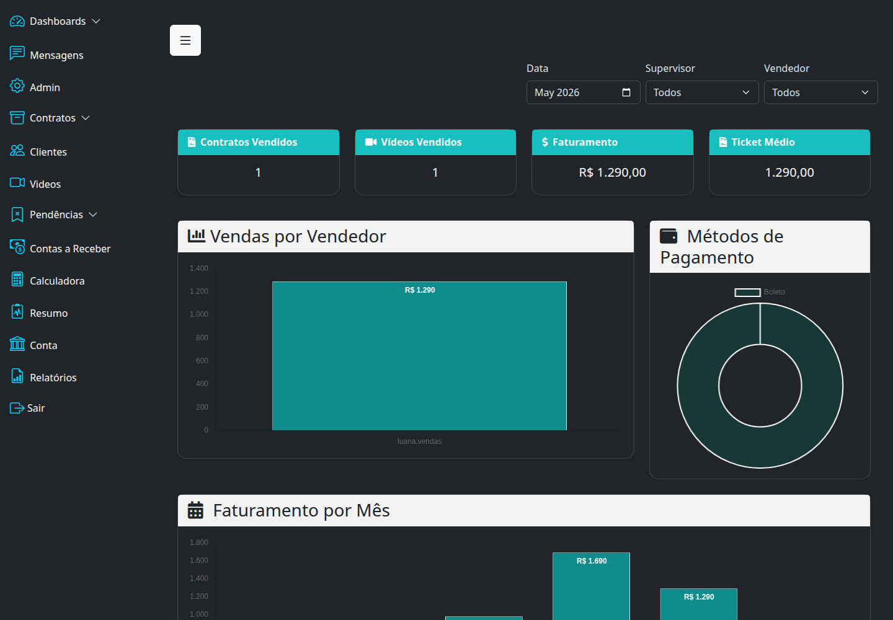
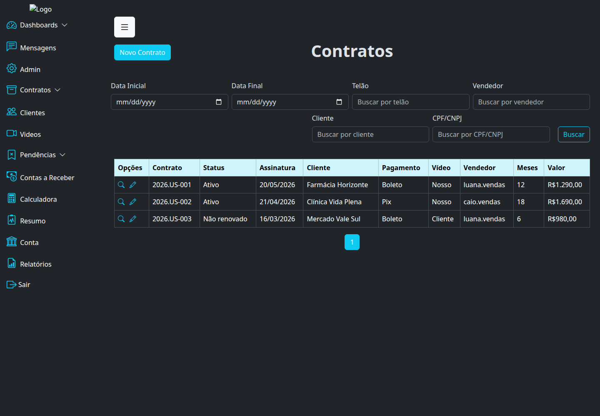
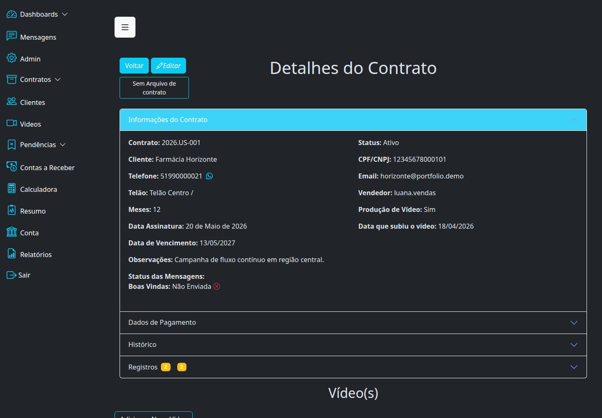
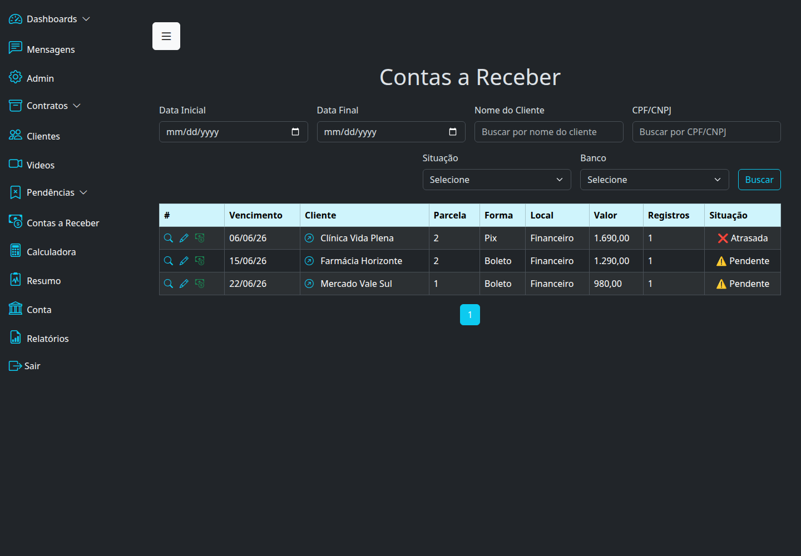
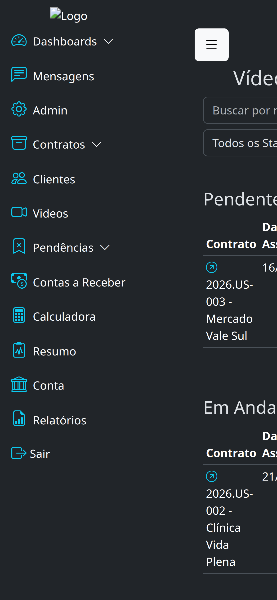

# Operação Comercial com Contratos e Vídeos

Estudo de caso de uma operação Django para gestão de contratos, vendedores, telões, parcelas, métricas comerciais e fluxo de vídeos.

O ambiente de portfolio usa um banco SQLite demo independente, usuário `demo` e dados totalmente fictícios.

Credenciais demo:

- `username`: `demo`
- `password`: `Demo@123456`

Telas destacadas:

- dashboard comercial
- listagem de contratos
- detalhe de contrato
- contas a receber
- pipeline de vídeos

Arquivos auxiliares:

- stack: [`stack.md`](./stack.md)
- features: [`features.md`](./features.md)
- setup: [`setup.md`](./setup.md)

## Telas

