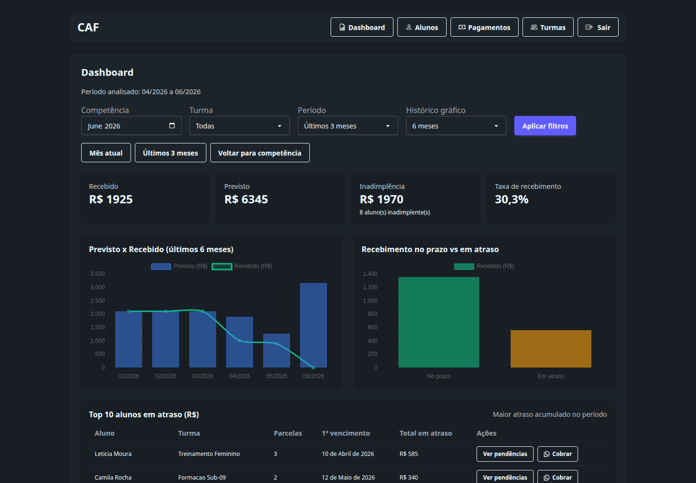
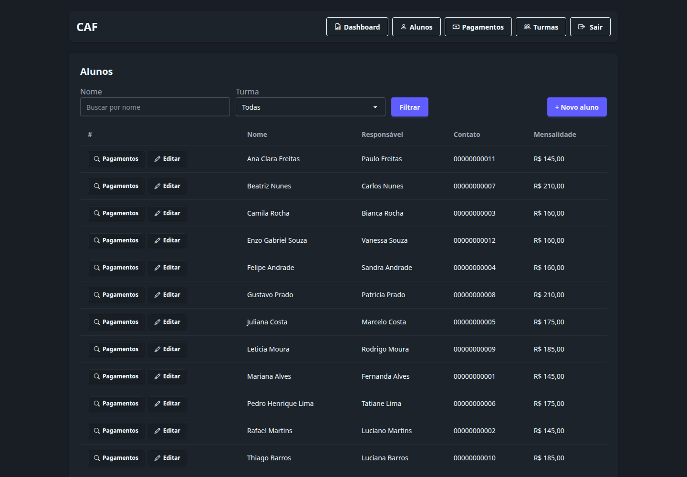
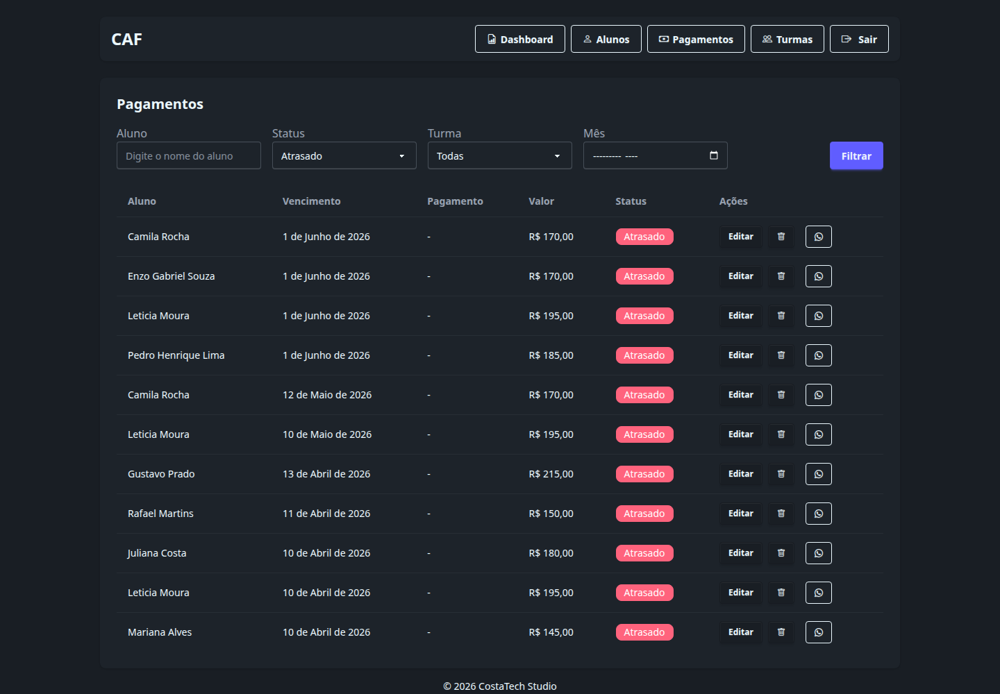
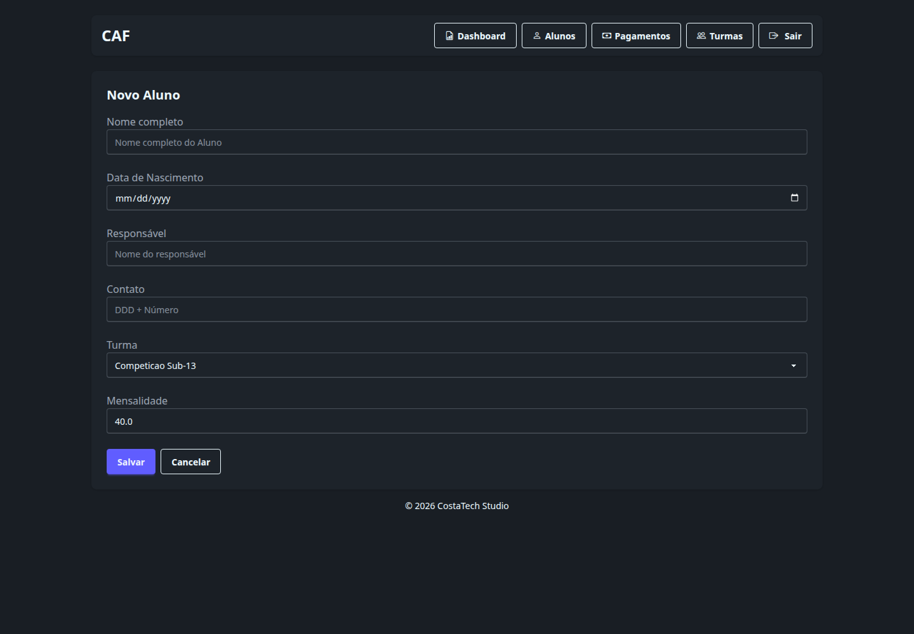
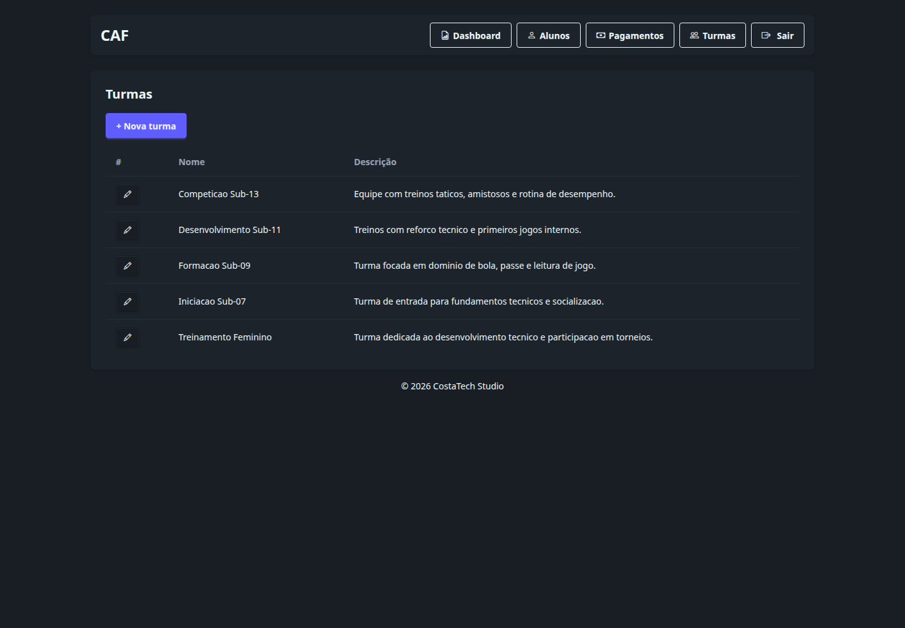
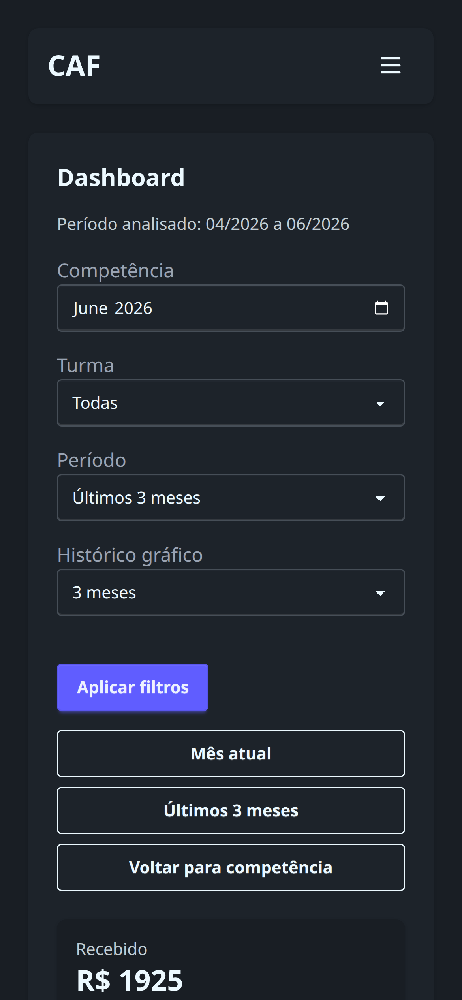

# Gestão de Escolinha Esportiva

Estudo de caso de um sistema administrativo para escolinha esportiva, com foco em gestão de turmas, alunos, mensalidades, cobrança e visão financeira.

## Visão geral

Esta aplicação organiza processos operacionais que normalmente ficam espalhados entre planilhas, mensagens e controles manuais. O sistema centraliza cadastro, acompanhamento de pagamentos e leitura gerencial em uma interface web simples e objetiva.

## Problema resolvido

O projeto foi desenhado para reduzir retrabalho administrativo, facilitar a identificação de inadimplência, acelerar cobranças e oferecer indicadores rápidos para a gestão da escolinha.

## Principais funcionalidades

- Gestão de turmas esportivas.
- Cadastro de alunos com responsável, contato e mensalidade.
- Controle de pagamentos com status pago, pendente e atrasado.
- Dashboard com indicadores financeiros e gráficos.
- Filtros por competência, turma, aluno e status.
- Atalhos de cobrança por WhatsApp.
- Geração automática mensal de cobranças.

## Stack utilizada

- Django 5
- Python 3
- SQLite para ambiente demonstrativo
- Django Templates
- Tailwind CSS + DaisyUI
- Chart.js
- Celery + django-celery-beat

## Destaques técnicos

- Backend monolítico com autenticação nativa do Django.
- Modelagem enxuta para domínio administrativo.
- Dashboard com agregações, indicadores e histórico mensal.
- Fluxo preparado para tarefas assíncronas e recorrência mensal.
- Base demo e branding fictício isolados para exibição pública.

## Estrutura desta área

```text
apps/avcl/
├── README.md
├── screenshots/
├── scripts/
├── stack.md
├── features.md
├── setup.md
└── demo/
```

## Screenshots

### Dashboard



### Gestão de alunos



### Controle de pagamentos



### Cadastro de aluno



### Gestão de turmas



### Experiência mobile



## Como preparar localmente

Partindo da raiz do repositório `Portifolio/`:

```bash
./apps/avcl/scripts/setup_demo_db.sh
./apps/avcl/scripts/run_demo_server.sh
```

Em outro terminal:

```bash
cd apps/avcl
npm install
npx playwright install chromium
npm run portfolio:screenshots
```

## Premissas

- O código-fonte original do projeto deve existir em um repositório irmão chamado `avcl/`.
- O banco demonstrativo fica em `apps/avcl/demo/portfolio.sqlite3`.
- O usuário demo gerado é `demo` com senha `Demo@123456`.
- Todos os dados de demonstração são fictícios.
