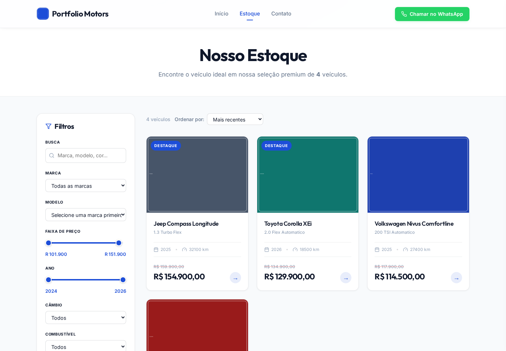
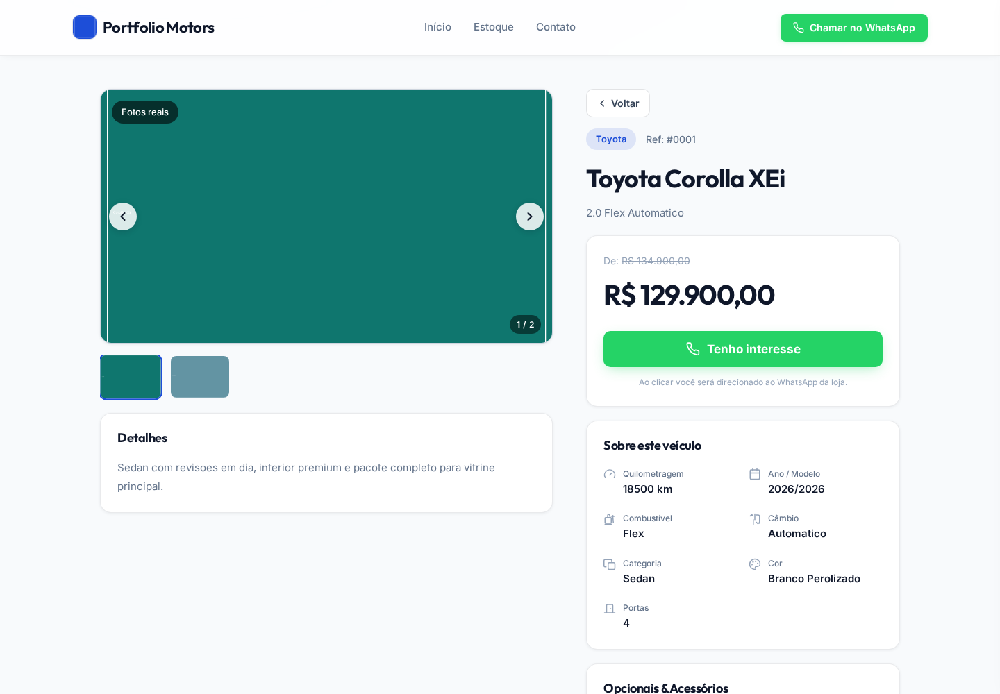
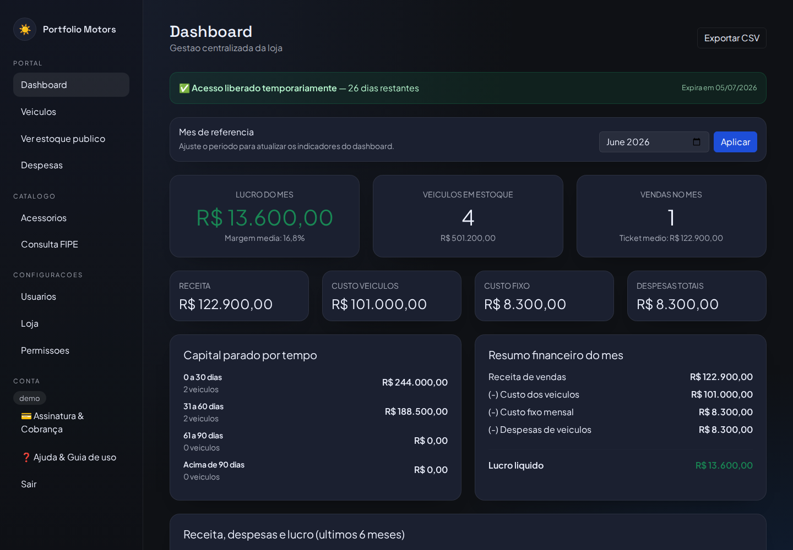
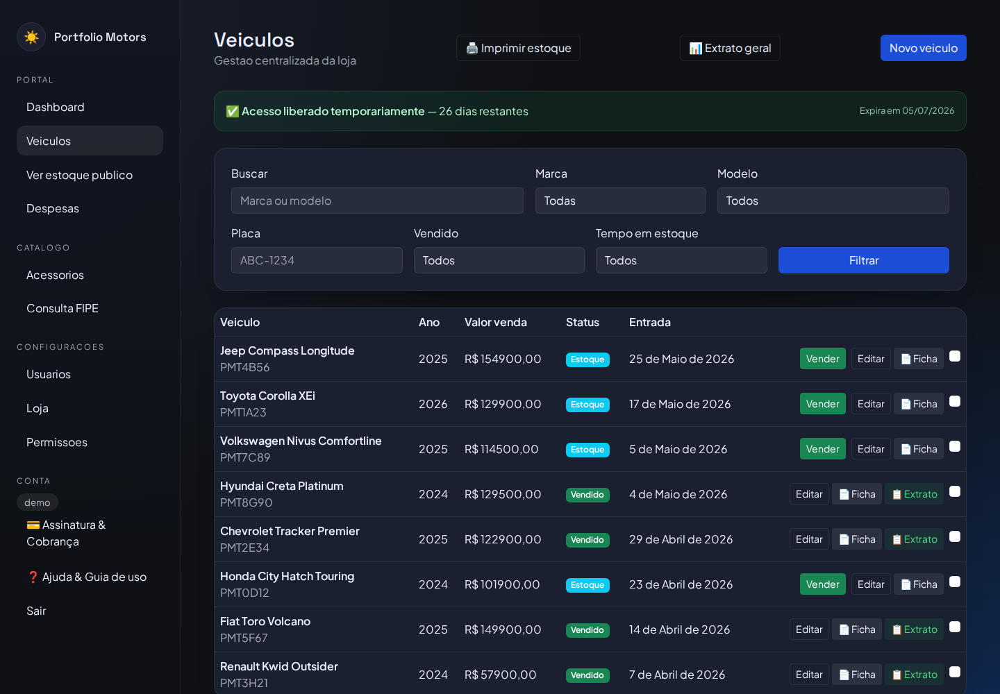
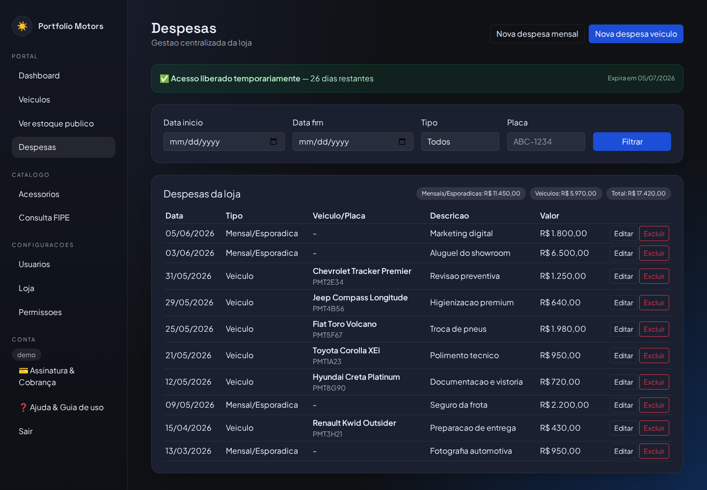
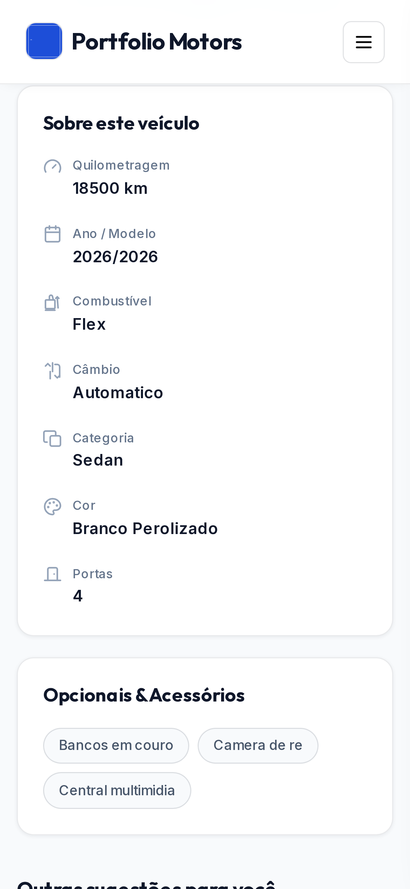

# loja_carros

Estudo de caso de um SaaS Django multi-tenant para lojas de veículos, com vitrine pública por domínio da loja e portal autenticado para operação comercial e financeira.

Este material de portfolio roda sobre um banco SQLite demo separado, com tenant local em `demo.localtest.me`, usuário `demo` e dados completamente fictícios. Nenhum dado operacional real foi incluído.

Credenciais demo:

- `username`: `demo`
- `password`: `Demo@123456`

Telas destacadas no portfolio:

- vitrine pública de estoque
- detalhe de veículo com galeria e CTA comercial
- dashboard do portal da loja
- gestão de veículos no portal
- controle de despesas e visão mobile

Arquivos de apoio:

- stack: [`stack.md`](./stack.md)
- features: [`features.md`](./features.md)
- setup local: [`setup.md`](./setup.md)

## Telas

