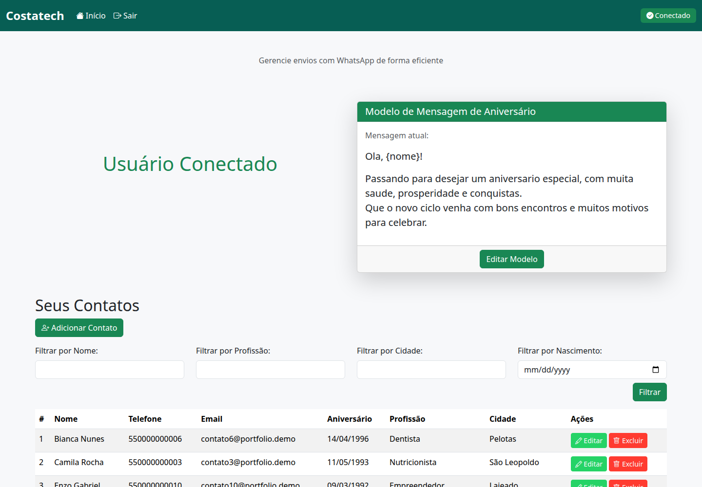
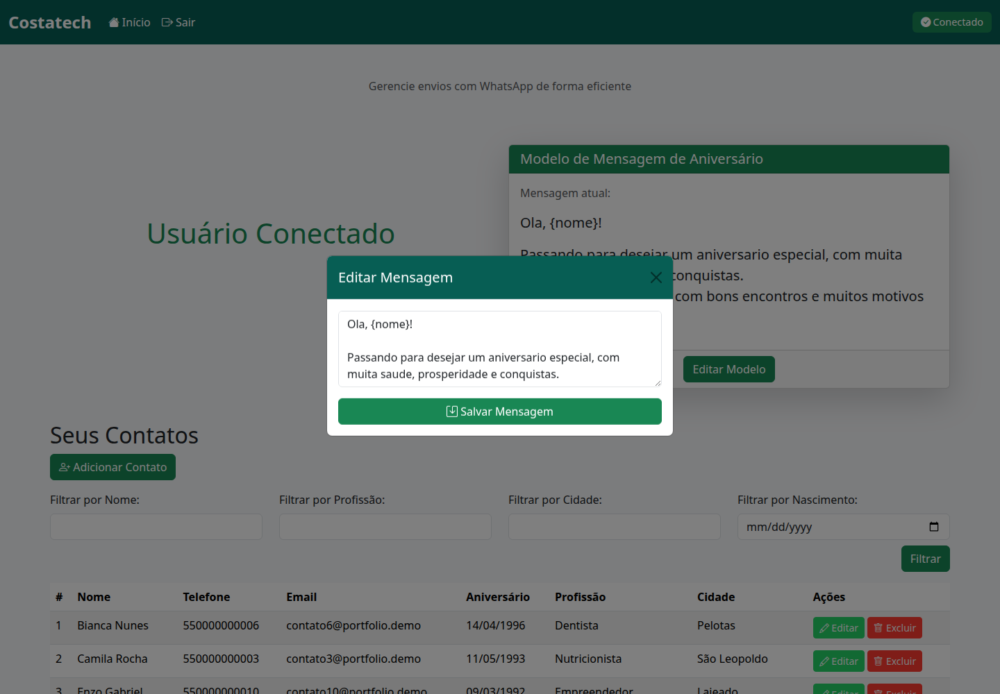
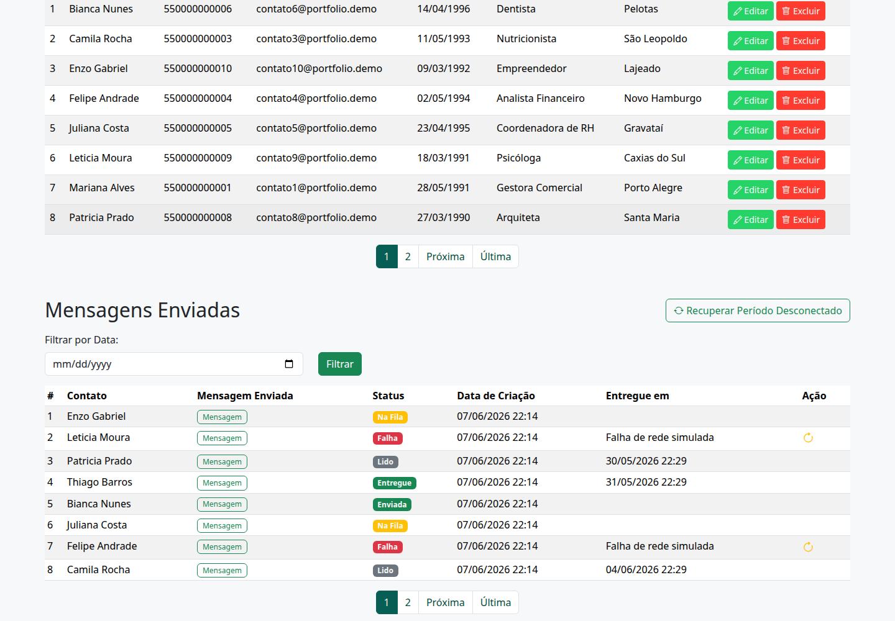
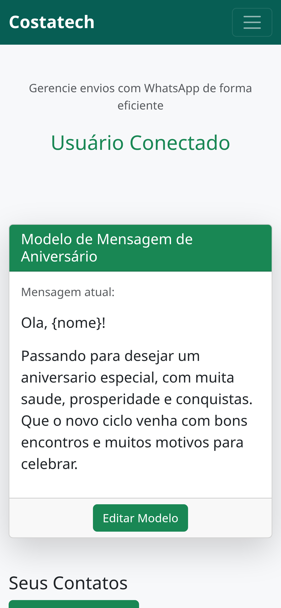

# Mensageria Automatizada para Relacionamento

Sistema web desenvolvido para gerenciar contatos, modelos de mensagem e histórico de envios automatizados via WhatsApp em campanhas de aniversário e relacionamento.

## Visão geral

Este projeto demonstra uma aplicação orientada a operação de comunicação: organiza a base de contatos, centraliza templates, acompanha status de entrega e reduz trabalho manual em campanhas recorrentes.

## Problema resolvido

Sem uma ferramenta dedicada, o envio de mensagens de aniversário depende de consultas manuais, listas descentralizadas e pouco controle sobre o que já foi enviado. A aplicação unifica cadastro, preparação da mensagem e acompanhamento do envio em uma única interface.

## Principais funcionalidades

- Cadastro e segmentação de contatos.
- Modelo reutilizável de mensagem.
- Histórico com status de fila, envio, entrega e leitura.
- Recuperação de aniversários não enviados.
- Preparação para integração com API de WhatsApp e tarefas agendadas.

## Stack utilizada

- Django 5
- Python 3
- SQLite no ambiente demonstrativo
- Django Templates
- Bootstrap
- Celery + django-celery-beat + django-celery-results

## Destaques técnicos

- CRUD de contatos com filtros por nome, profissão, cidade e aniversário.
- Modelagem para rastreamento de status de mensagens e referência de aniversário.
- Arquitetura pronta para processamento assíncrono e webhooks.
- Ambiente demo isolado do banco original.

## Telas principais







## Como preparar localmente

```bash
./apps/messages/scripts/setup_demo_db.sh
./apps/messages/scripts/run_demo_server.sh
```

Em outro terminal:

```bash
cd apps/messages
npm install
PLAYWRIGHT_BROWSERS_PATH=.playwright-browsers npx playwright install chromium
npm run portfolio:screenshots
```

## Observação

Todos os dados, contatos e mensagens desta versão de demonstração são fictícios.
