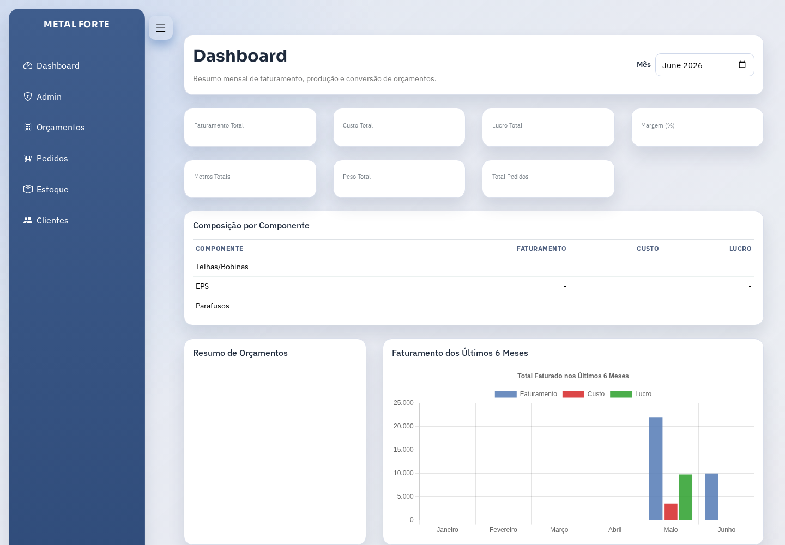
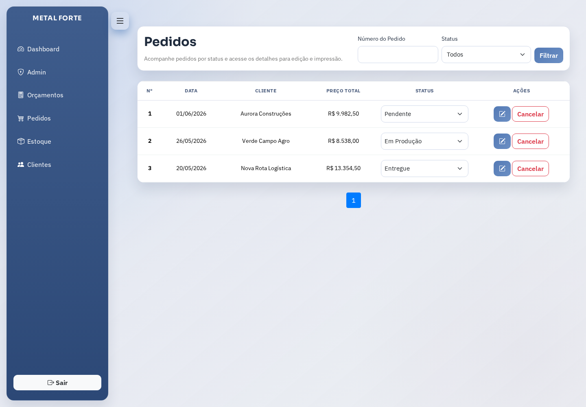
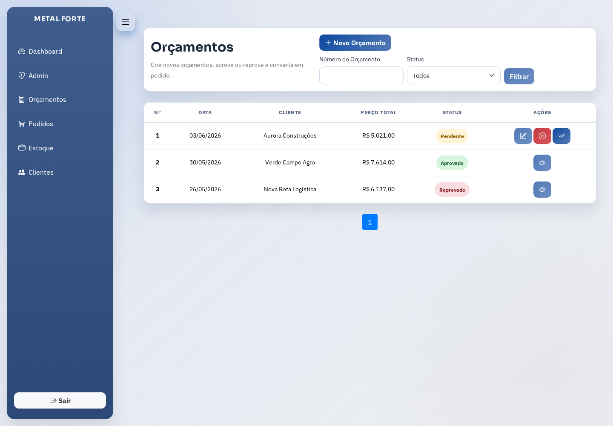
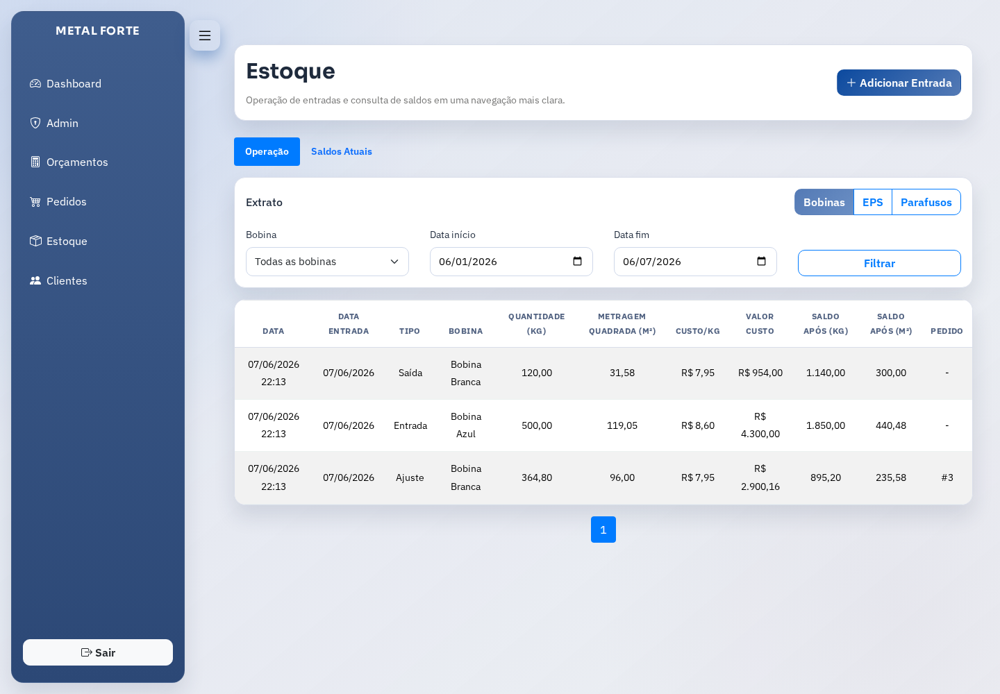
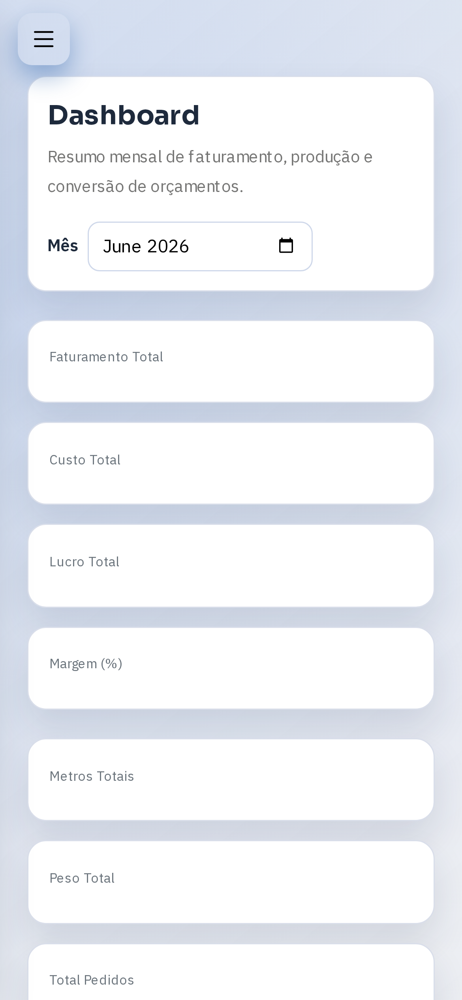

# Plataforma Comercial e de Produção Industrial

Sistema web desenvolvido para centralizar o fluxo comercial e produtivo de uma operação industrial leve, cobrindo orçamentos, pedidos, estoque e indicadores financeiros.

## Visão geral

A aplicação organiza uma rotina que normalmente fica fragmentada entre planilhas, controles avulsos e mensagens internas. O sistema integra criação de orçamentos, conversão em pedidos, gestão de estoque e acompanhamento de margem em uma única interface.

## Problema resolvido

Sem uma ferramenta centralizada, a operação comercial perde rastreabilidade entre proposta, produção e entrega. Este projeto reduz retrabalho, melhora a visão de custos e permite acompanhar faturamento, margem e insumos consumidos de forma mais objetiva.

## Principais funcionalidades

- Gestão de pedidos e orçamentos.
- Cadastro de clientes, produtos, espessuras e formatos.
- Controle de estoque de bobinas, EPS e parafusos.
- Dashboard com faturamento, custo, lucro e composição de componentes.
- Acompanhamento de margem e últimos pedidos.

## Stack utilizada

- Django 5
- Python 3
- SQLite no ambiente demonstrativo
- Django Templates
- Bootstrap + Chart.js
- Jazzmin para administração

## Destaques técnicos

- Cálculo automático de totais por pedido e orçamento.
- Snapshot de custo e venda por item para preservar histórico financeiro.
- Estrutura pronta para baixa e estorno de estoque vinculada ao status do pedido.
- Dashboard analítico baseado em agregações mensais.

## Telas principais







## Como preparar localmente

```bash
./apps/metalforte/scripts/setup_demo_db.sh
./apps/metalforte/scripts/run_demo_server.sh
```

Em outro terminal:

```bash
cd apps/metalforte
npm install
PLAYWRIGHT_BROWSERS_PATH=.playwright-browsers npx playwright install chromium
npm run portfolio:screenshots
```

## Observação

Todos os dados e nomes operacionais utilizados nesta versão demonstrativa são fictícios.
